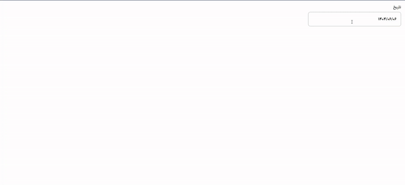

This is a DatePicker (Shamsi/Gregorian) component that is suitable for desktop size.

It is implemented with [Next.js](https://nextjs.org) project bootstrapped with [`create-next-app`](https://github.com/vercel/next.js/tree/canary/packages/create-next-app).

For handling dates and formating them, [jalali-moment](https://www.npmjs.com/package/jalali-moment) library is used.


## Demo



## Getting Started

You can clone the project or just copy the code of each file.

If you choose to clone the project, here are the steps to see the result:
```bash
npm install

npm run dev
# or
yarn dev
# or
pnpm dev
# or
bun dev
```

Open [http://localhost:3000](http://localhost:3000) with your browser to see the result.